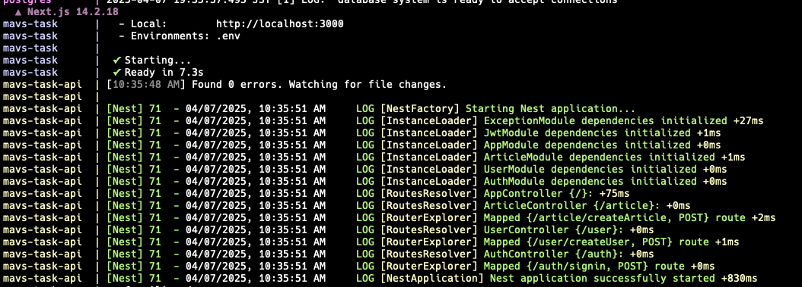

# Next.js + Nest.js のベースプロジェクトです。

## 環境構築方法

Node のバージョンは フロントエンドが18.17.0、バックエンドが20.10.0 です。  
Volta をインストールしている場合は自動でバージョンが切り替わります。

### リポジトリのフォーク

リポジトリの右上にあるフォークボタンをクリック

https://github.com/user-attachments/assets/c27496ba-cb8d-4cf4-9593-6fb84018120f

```
git clone git@github.com:ユーザー名/mavs-task-nextjs-nestjs.git
cd mavs-task-nextjs-nestjs
```

### パッケージインストール

フロントエンドのパッケージインストール&環境変数追加

```
cd frontend
npm install
cp .env.example .env
```

バックエンドのパッケージインストール

```
cd ../
cd backend
npm install
cp .env.example .env
```

### Docker を起動（ルートディレクトリで実行）

Docker Desktop を起動しておきます。

```
cd ../
docker compose up --build
```

ターミナルにこのように表示されていれば問題なく動作しています。


※postgresql には初期構築時にテストデータが投入されます。

### 動作確認

http://localhost:3000

このように表示できていれば ok です！


## ログイン機能について

| メールアドレス  | パスワード |
| --------------- | ---------- |
| sample@test.com | password   |

http://localhost:3000/signin にアクセスし、  
上記のメールアドレス、パスワードを入力しログインボタンクリック  
右上にメールアドレスが表示されていればログイン処理が正常に動作しています！

https://github.com/user-attachments/assets/6abafe98-e804-42a7-a56e-20314db0a519

## データベースクライアントツール

pgAdmin を使用してテーブルを見ることができます。

### アクセス方法

http://localhost

| メールアドレス | パスワード |
| -------------- | ---------- |
| root@test.com  | root       |

### データベース登録

Create Server から下記内容を設定する
| タブ | 設定項目 | 設定値 |
| ---------- | -------------------- | -------- |
| General | Name | postgres |
| Connection | Host | postgres |
| | Port | 5432 |
| | Maintenance Database | postgres |
| | Username | root |
| | Password | root |
